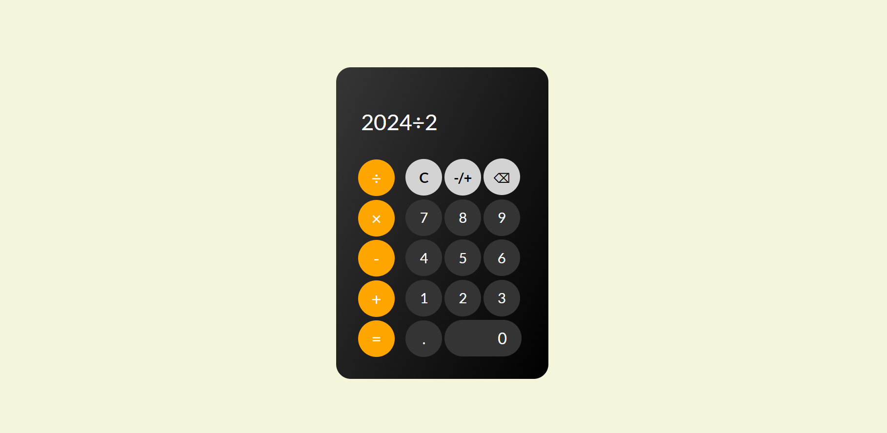

# JavaScript Calculator

This is a simple calculator application inspired from the iOS system calculator built using HTML, CSS, and JavaScript. It provides basic arithmetic operations such as addition, subtraction, multiplication, and division.

## Features

- Clean and responsive user interface
- Perform basic arithmetic calculations
- Clear the input field
- Delete the last entered digit
- Change the sign of the input value

## Technologies Used

- HTML5
- CSS3
- JavaScript

## Getting Started

To run the calculator locally, follow these steps:

1. Clone the repository or download the source code.
2. Open the `index.html` file in a web browser.

Alternatively, you can visit the live demo at [insert your live demo URL here].

## Usage

1. Click the number buttons to enter the desired values.
2. Click the operator buttons (+, -, ×, ÷) to perform the respective arithmetic operation.
3. Click the "=" button to get the result.
4. Click the "C" button to clear the input field.
5. Click the "⌫" button to delete the last entered digit.
6. Click the "-/+" button to change the sign of the input value.

## Contributing

Contributions are welcome! If you find any issues or have suggestions for improvements, please open an issue or submit a pull request.

## License

This project is licensed under the [MIT License](LICENSE).

## Acknowledgments

- [Google Fonts](https://fonts.google.com/) for providing the Lato font used in the calculator.
